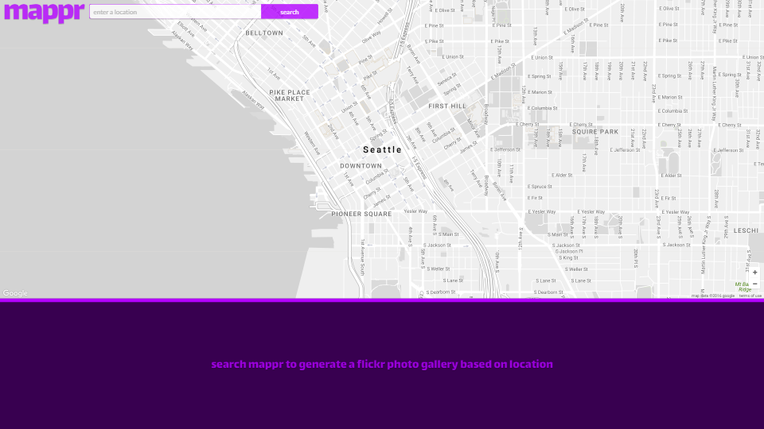
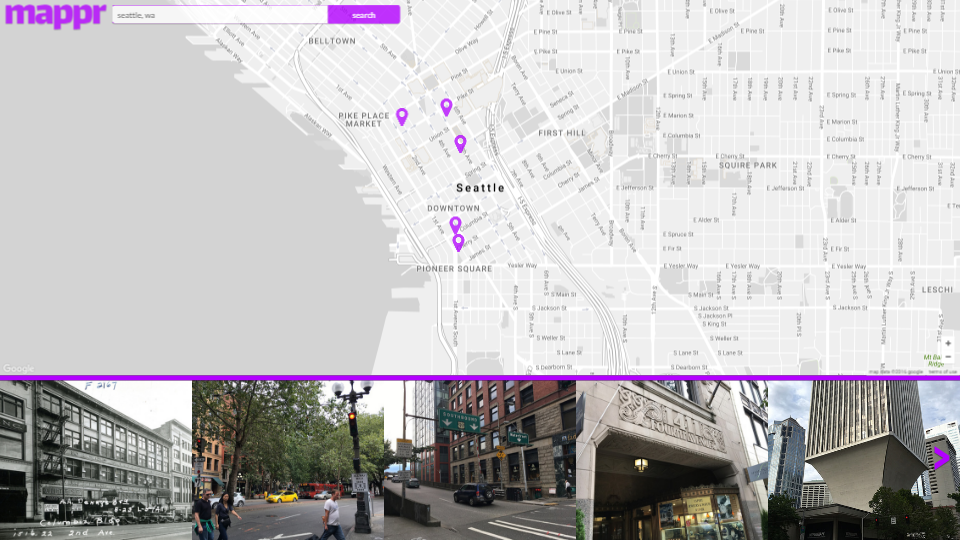
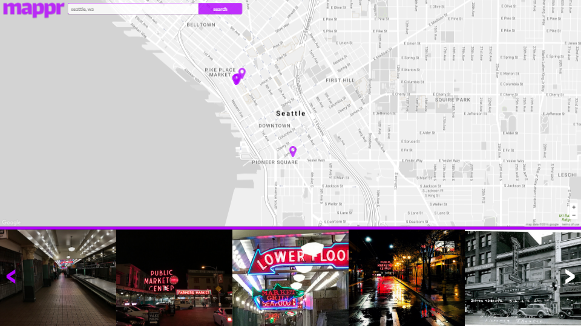
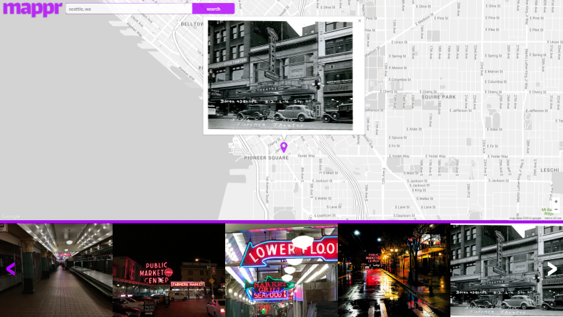

# Mappr

## Live Version
Live: http://tw3080.github.io/mappr/

## Summary
Mappr is an interactive gallery and map of Flickr photos which integrates the Flickr API and the Google Maps API to display photos based on locations searched for by the user. When users search for a location, the map populates with markers which correspond to the geolocations of Flickr photos in that area, and the gallery populates with thumbnails of those photos. Users can click the markers or the thumbnails to view larger versions of the images, and the images are displayed in descending order starting with the most recently taken photos in that area.

## Walkthrough

### Home

    

On initial load, an empty map and gallery are shown and the user is prompted to search for a location.

### Search Results

    

After the user searches for a location, the map and gallery will populate. Clicking either the markers or the images in the gallery will allow the user to view a larger version of the thumbnails.

    

Users can click the left and right arrows in the gallery carousel to view more images, and the map markers will update accordingly.

### Expand Images

    

If the user clicks on a marker or an image in the gallery, an info window will display over the marker which corresponds to that particular image. The info window will contain a larger version of the image.

## Technology Used
* HTML5
* LESS / CSS3
* JavaScript
* jQuery
* NPM
* Flickr API
* Google Maps API
* Normalize.css
* Font Awesome

## Future Plans
* I think a 'random location' feature would be cool.
* Displaying more information (such as which user the photo belongs to, the photo's description, or tags) would make the app more interesting.
* Possibly add auto location detection.
